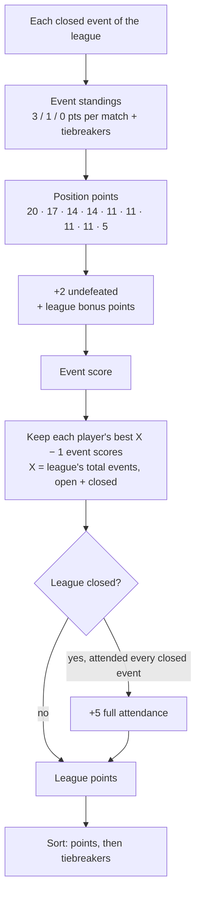

# League leaderboard — current rules

How a league's standings are computed, as implemented in `js/leaderboard.js`
(`computeEventLeaderboard` → `computeLeaguePoints` → `compareLeagueStandings`).
Topdeck series have no points leaderboard; everything below applies to real
leagues only.

The standings are always computed live from the database (league page,
Bacheca top 8), so opening, closing, adding or deleting an event is reflected
on the next page load. Only the league auto-badges (winner, 1st/2nd/3rd) are
cached, and they're refreshed automatically whenever an event or league is
created, opened, closed or deleted in admin.

## Overview

## 1. Each event: finishing position

Only **closed** events count. Within an event, players are ranked by:

1. **Match points**: win 3, draw 1, loss 0. A **bye** is a win (3 pts). A
   **drop** round is ignored entirely (no points, not a match played).
2. **Manual rank** set by the admin, only to reorder players tied on points.
3. **Opponents' Match Win %**
4. **Game Win %**
5. **Opponents' Game Win %**
6. Name (alphabetical), as a last resort.

The percentages use the official Magic tournament formulas (a draw counts as a
third of a win, every percentage floored at 33%, a bye counts as a 2-0).

## 2. Event score

| Position | Points |
|---|---|
| 1st | 20 |
| 2nd | 17 |
| 3rd – 4th | 14 |
| 5th – 8th | 11 |
| 9th and below | 5 |

Plus:

- **+2 undefeated**: at least one win and no losses or draws in that event.
- **League bonus points** (for one-off adjustments), if set: entered per
  player in the "Bonus lega" column of that event's leaderboard in admin
  (matches view), while the event is open.

## 3. League points

**Best X − 1 results.** Each player counts at most their best **X − 1** event
scores, where **X is the league's total number of events, open and closed**
(including scheduled ones not played yet). Never fewer than 1.

- Nothing is dropped until a player has more results than X − 1, which only
  happens to someone who plays **every** event of the league: they lose
  their single worst result.
- A player who missed at least one event keeps all their results (the missed
  event is effectively their "dropped" one).
- X comes from the `league_event_count` database function, so it also counts
  open events hidden from visitors. **Create the league's future events in
  admin ahead of time**, or X (and so the live standings) will be too low.
- Adding an event later raises X by one, even for an already-closed league.

**+5 full attendance.** Awarded only **once the league is closed**, to players
with an entry in every closed event of the league. Reopening the league takes
it back out.

## 4. League tiebreakers

Players tied on league points are ordered by:

1. **Most 1st places** in the league's events, then most 2nd places, then most
   3rd places, and so on (every event counts, including a result left out by
   the best X − 1 rule).
2. **Match Win %** over the league's matches.
3. **Game Win %** over the league's matches.
4. **Opponents' Game Win %** over the league's matches.
5. Name (alphabetical), as a last resort.

The "Vincitore" tile on the league page shows joint winners only if players are
still tied after step 4.

## Example

A league with **X = 7** events, so each player counts their best **6** results.

| Player | Event scores | Counted | Full attendance (closed) | League points |
|---|---|---|---|---|
| A | 22, 14, 17, 5, 11, 20, 14 (all 7) | drops the 5 → 98 | +5 | **103** |
| B | 17, 17, 14, 11, 20, 14 (6 of 7) | all 6 → 93 | — | **93** |

(A's 22 is a 1st place, 20, with the +2 undefeated bonus.)

While the league is still open, A has 98 points and B has 93. The +5 only
arrives when the league is closed.
